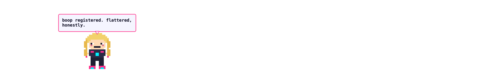

# Kursor Kid 👾

A macOS menu bar app that puts **Kiki** — a pixel-art cyberpunk girl on your screen. She walks along the bottom edge,
reacts to your cursor, dances when you type, gets booped when you click her,
and says funny things powered by Claude Haiku.



## What she does

- **Wanders** the bottom of your screen, sometimes sits down for a break
- **Waves** when your cursor gets close; **startles** if you get *too* close
- **Dances** when you're typing fast (needs Accessibility permission — keys
  are only *counted*, never read)
- **Boop her** (click) for a squash, pixel hearts, and a sassy one-liner
- **Drag her** around; she falls back to the ground when you let go
- **Falls asleep** if you've been away for 5 minutes
- **Chats** via Claude Haiku: when clicked, on a timer, and reacting to
  context (app switches, typing marathons, time of day). Works offline with
  built-in lines if you don't add an API key.

## Setup

1. Launch the app — Kiki appears bottom-left, and a 👾 icon joins your menu bar.
2. Grant **Accessibility** when prompted (enables the typing dance).
3. Menu bar → **Settings…** → paste your Anthropic API key (stored in your
   Keychain) and hit **Test Key**.

## Building

```bash
swift test                        # unit tests (engine, quips, art, settings)
swift run KursorKid               # run from source
scripts/build-app.sh              # signed .app in dist/
scripts/build-app.sh --notarize   # notarized + stapled .app, zip, and DMG
```

Notarization uses the `notarytool` keychain profile, falling back to
`APPLE_EMAIL` / `APPLE_APP_PASSWORD` from `.env`.

### Dev utilities

```bash
swift run KursorKid --dump-sprites /tmp/kiki   # render all frames as PNGs
swift run KursorKid --dump-icon /tmp/icon.png  # render the 1024px app icon
swift run KursorKid --self-shot /tmp/s.png --demo-bubble  # scene screenshot
```

## Privacy

- Keystrokes are **counted only** — never inspected, logged, or stored.
- The only context sent to the Claude API is: the trigger type, local time,
  and (if context reactions are on) the frontmost app's *name*.
- Your API key lives in the macOS Keychain.

## Architecture

- `Sources/KursorKidCore` — pure-Swift, unit-tested: behavior state machine,
  Claude client with canned fallback, pixel-art renderer, sprite frames,
  settings.
- `Sources/KursorKid` — AppKit/SpriteKit shell: transparent click-through
  overlay window, sprite scene, global input monitoring, menu bar, SwiftUI
  settings.

Design docs live in `docs/superpowers/specs/`.
